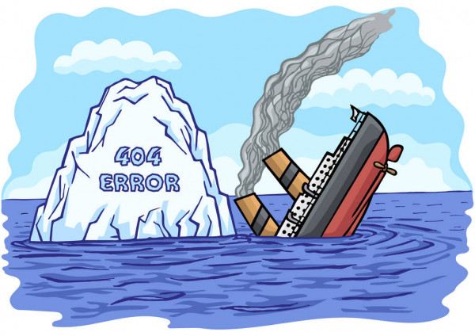

# Titanic Dataset Analysis

This repository contains a Jupyter Notebook that performs an analysis on the famous Titanic dataset. The notebook explores the dataset, cleans the data, performs feature engineering, and trains a machine learning model to predict survival outcomes for passengers on the Titanic.

## Dataset Description

The Titanic dataset is a classic dataset used in machine learning and data analysis. It consists of information about passengers aboard the Titanic, including their demographics, cabin class, ticket fare, and survival status. The dataset is widely used for predictive modeling and exploring various data analysis techniques.

  

## Notebook Contents

The Jupyter Notebook in this repository walks through the entire data analysis process step by step. Here's an overview of the notebook's contents:

1. **Data Exploration**: The notebook begins by loading the dataset and performing initial exploratory data analysis (EDA). It examines the dataset's structure, summary statistics, missing values, and data distributions.

2. **Data Preprocessing**: This section focuses on data preprocessing and cleaning. It handles missing values, performs feature engineering, and prepares the data for modeling.

3. **Exploratory Data Analysis**: The notebook conducts in-depth exploratory data analysis to gain insights into the relationships between different variables. It visualizes the data and explores patterns and correlations.

4. **Model Building**: In this section, a machine learning model is trained to predict passenger survival. The notebook uses popular algorithms such as logistic regression, random forests, and support vector machines. It evaluates the models using appropriate performance metrics.

5. **Model Evaluation**: The trained models are evaluated using cross-validation and additional evaluation metrics. The notebook discusses the model performance and provides insights into the predictive power of the features.

6. **Conclusion**: The notebook concludes with a summary of the analysis, key findings, and recommendations for further improvements.

## Dependencies
* pandas
* numpy
* xgboost
* sklearn
* math
* eli5
* shap
* pdpbox
* scipy
* matplotlib
* seaborn
